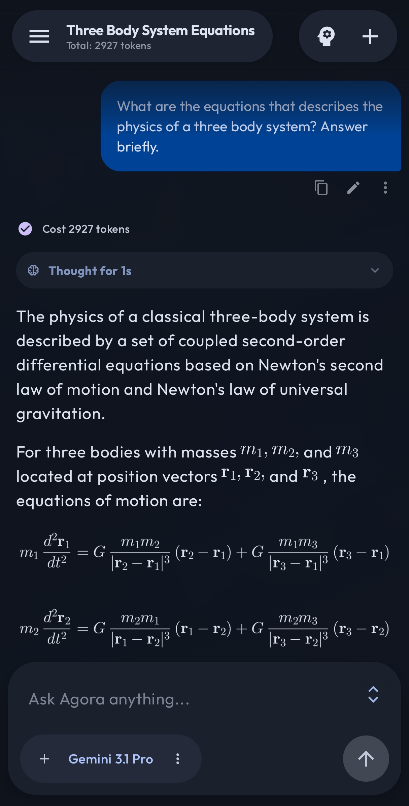
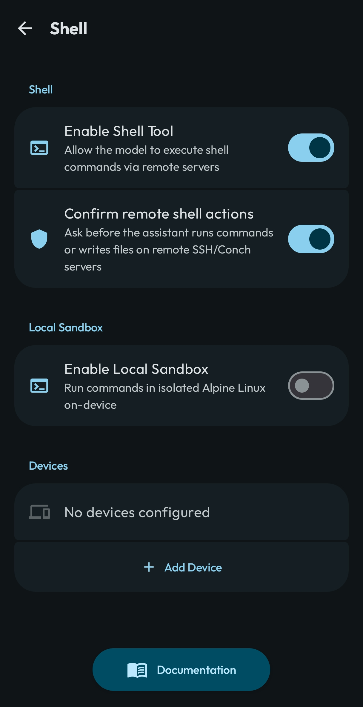
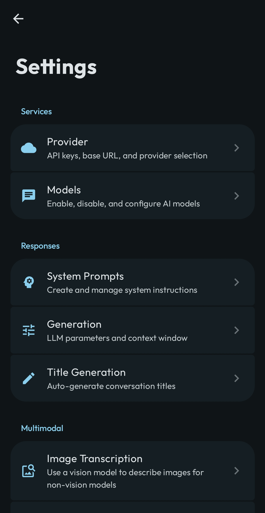

  

  # Agora

  **BYOK LLM client with multi-provider access, agentic workflows, and remote device control.**

  
  
  
   **English** | [中文](README_CN.md)

  

## Download

&nbsp;&nbsp;

&nbsp;&nbsp;

- **F-Droid (Recommended)** — Install via [F-Droid](https://f-droid.org/), search for **Agora**.
- **Google Play** — Install from [Google Play Store](https://play.google.com/store/apps/details?id=com.newoether.agora).
- **GitHub Releases** — Download the latest `.apk` from the [Releases page](https://github.com/newo-ether/Agora/releases).
- **Build from Source** — Clone and build with Android Studio (see [Getting Started](#getting-started)).

---

**Agora** — a BYOK Android client for AI power users. Connect to 8+ built-in providers (plus unlimited custom endpoints) with your own keys, branch conversations non-linearly, run models locally via llama.cpp, and control remote machines through encrypted shell. Everything stored on-device, nothing logged elsewhere. Open source, MIT licensed.

## Screenshots

<table>
<tr>
<td width="33%"></td>
<td width="33%"></td>
<td width="33%"></td>
</tr>
</table>

## Why Agora?

- **No Middlemen:** Direct API connections. No telemetry, no tracking, no corporate servers logging your conversations. Everything lives locally in a Room database.
- **Non-Linear Thought:** A tree-structured message database lets you edit any past message, regenerate responses, and explore alternative branches without losing context.
- **Agentic by Default:** Multi-round tool calling with web search, code execution, remote file operations, memory management, and semantic conversation search.
- **Remote Control:** Manage servers, edit files, and search code on remote machines via the [Conch](https://github.com/newo-ether/conch) protocol — end-to-end encrypted with ECDH + AES-256-GCM.

## Features

### Multi-Provider Access
- **8 built-in providers:** OpenAI, Anthropic, Google Gemini, DeepSeek, Qwen (DashScope), OpenRouter, Ollama, Local (GGUF via llama.cpp)
- **Unlimited custom providers** with arbitrary base URLs and API keys
- **BYOK:** Bring your own API keys — no subscriptions, no middlemen
- **Multiple API keys per provider** with named aliases for easy rotation
- Per-provider base URL override for proxies and self-hosted endpoints

### Agentic Tools
- **Web Search** — DuckDuckGo Lite (anonymous, no key), Brave, Serper, Tavily, and SearXNG integration
- **Code Execution** — Gemini code execution for running and testing code inline; Alpine Linux sandbox via PRoot with SAF file access
- **Image Generation** — BYOK text-to-image via OpenAI-compatible `/v1/images/generations`, rendered inline in chat
- **Remote Shell & File I/O** — Execute commands, read/write/edit/glob/grep files on remote servers via [Conch](https://github.com/newo-ether/conch)
- **Memory** — Persistent active memory and saved memory files across conversations
- **Conversation Search** — RAG-powered semantic search over chat history

### Thinking & Reasoning
- Deep reasoning: OpenAI o1/o3, Anthropic extended thinking, Gemini thinking, DeepSeek-R1, Qwen QwQ
- Configurable thinking level (low/medium/high)
- Streaming think-tag renderer with collapsible UI and duration tracking

### On-Device Intelligence
- **Local LLM inference** via llama.cpp — run GGUF models entirely offline
- **Local embeddings** for on-device semantic search (RAG)
- **Ollama** provider for self-hosted models on your local network

### Remote Device Control (Conch Protocol)
- ECDH key exchange + AES-256-GCM encryption + HMAC-SHA256 signing
- Token bucket rate limiting and nonce-based anti-replay protection
- **Multi-device support** — configure and switch between multiple remote servers
- **MCP integration** — Conch as a Claude Desktop MCP server

### Knowledge Management
- **RAG semantic search** across all past conversations using cosine similarity
- Configurable similarity threshold and keyword/model search methods
- Selectable embedding model (remote or local), independent of chat model
- **Context window management** with real-time token counting and sliding window
- Visual context rollout indicator dims messages outside the active window

### Data Portability
- **.agora Export/Import:** Conversations, memories, prompts, settings, and API keys in one portable file
- **Merge, Replace, and Skip** import strategies
- **Auto Backup** — periodic WorkManager-based backup with configurable period, categories, and retention
- **Third-Party Import:** Claude and ChatGPT export formats (.zip / .json)
- API key safety warnings for both export and import workflows

### Customization
- **System prompt templates** with three-section editor (system prompt + user prepend + user append)
- Variable substitution: `{sent_time}`, `{sent_date}`, and extensible variable system
- Per-conversation model and system prompt switching
- Per-message model selection from the chat bottom bar
- Per-conversation generation overrides (temperature, max tokens, penalties)
- **Auto title generation** with configurable model

### UI & UX
- Modern Material 3 design in Jetpack Compose with dynamic color (Material You)
- Light / Dark / System theme modes with configurable color schemes
- **Non-linear branching:** Edit any past message and branch into alternative conversation paths
- Real-time streaming with message anchoring and animated auto-scrolling
- Haptic feedback throughout the UI (long-press, selection, success/error)
- Immersive gesture-driven image and media viewer
- Markdown rendering with syntax highlighting, LaTeX math, and code blocks
- Image, video, PDF, and file attachment support with thumbnails
- iOS-style collapsing large-title in settings with shared page transition animations
- Blur effects with configurable performance toggle
- English, Chinese, and Traditional Chinese language support

## Documentation

📖 **[Browse the User Manual](https://newo-ether.github.io/Agora/)** — 15 pages covering installation, providers, tools, search, memory, shell, and more.

🏗️ **[Architecture Guide](ARCHITECTURE.md)** — complete codebase walkthrough: data layer, API providers, JNI, UI, and data flows.

## Getting Started

### Prerequisites
- [Android Studio](https://developer.android.com/studio) (Ladybug or newer recommended)
- Android SDK 34+
- A valid API key from a supported provider

### Quick Setup

<table>
<tr>
<td width="20%"><b>① Launch</b> Open Agora on your device.</td>
<td width="20%"><b>② Settings</b> Open <b>Settings</b> from the nav bar.</td>
<td width="20%"><b>③ API Key</b> Select a <b>Provider</b> and add your <b>API Key</b>.</td>
<td width="20%"><b>④ Models</b> <b>Models</b> → "Sync from All Providers."</td>
<td width="20%"><b>⑤ Customize</b> System prompts, context, search, memory.</td>
</tr>
</table>

### Running Local Models

<table>
<tr>
<td width="25%"><b>① Place</b> Put a GGUF model file on your device.</td>
<td width="25%"><b>② Import</b> Settings → Provider → Local → "Import GGUF Model".</td>
<td width="25%"><b>③ Configure</b> Set context size, temperature, and other parameters.</td>
<td width="25%"><b>④ Select</b> Choose your local model from the chat picker.</td>
</tr>
</table>

### Setting Up Remote Shell (Conch)

<table>
<tr>
<td width="33%"><b>① Deploy</b> Deploy the <a href="https://github.com/newo-ether/conch">Conch server</a> on your target machine.</td>
<td width="33%"><b>② Add Device</b> Settings → Shell Devices → add URL and API key.</td>
<td width="33%"><b>③ Use</b> The model auto-discovers shell devices for commands, files, and search.</td>
</tr>
</table>

## Tech Stack

- **Language:** [Kotlin](https://kotlinlang.org/)
- **UI Framework:** [Jetpack Compose](https://developer.android.com/jetpack/compose) (Material 3, dynamic color)
- **Architecture:** MVVM with Kotlin Coroutines & Flow
- **Local Storage:** [Room Database](https://developer.android.com/training/data-storage/room) with tree-structured message schema & DataStore Preferences
- **Networking:** OkHttp with SSE streaming
- **Serialization:** `kotlinx.serialization`
- **Native:** llama.cpp via Android NDK (CMake) for on-device LLM inference and embeddings
- **Image Loading:** Coil
- **Markdown:** Multiplatform Markdown Renderer M3
- **Math:** JLaTeXMath-Android

## Contributing

Contributions are welcome! Feel free to fork the repository, submit pull requests, or open an issue.

## Privacy

Agora does not collect, store, or transmit any personal data. All conversations, API keys, and settings are stored locally on your device. Messages are sent directly from your device to the AI provider you configure — no intermediary servers, no telemetry, no tracking. See the full [Privacy Policy](PRIVACY.md).

## License

This project is open-source under the [MIT License](LICENSE).
